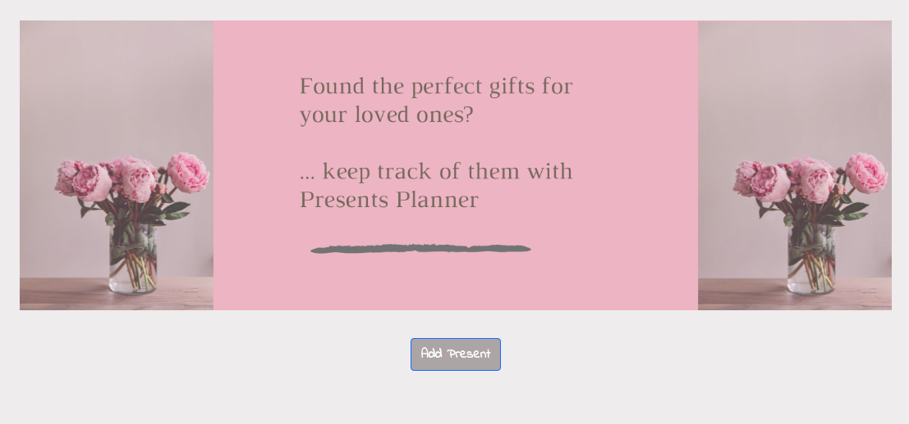
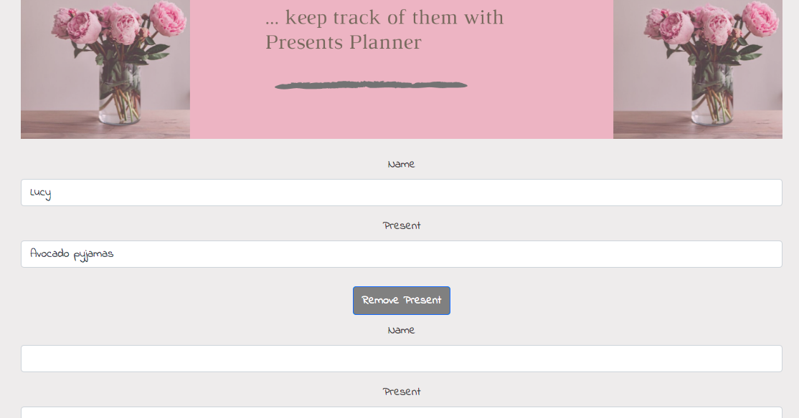

# Presents Planner

Test-driving a React application with Enzyme and Jest.
Presents Planner allows the user to save present ideas for their friends and family.

### How to use:

* Clone this repo:
```html
git clone https://github.com/emilyjspencer/Presents.git
```

* Cd into the repo on your computer
* Run the following to install the dependencies:
```html
npm install
```
* Run the following to start the React application:
```html
npm start
```
The application will open automatically in the browser

### Built with: 
* React
* React Bootstrap
* CSS

### Tested with:
* Enzyme
* Jest

### What it looks like:




Deployed with Surge at: pale-plastic.surge.sh